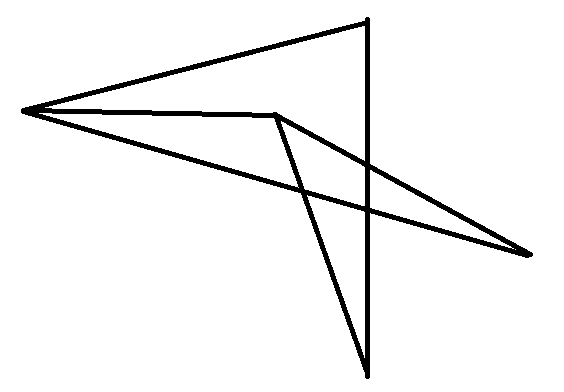
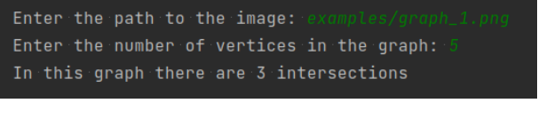

# Задача № 214

### Условие
На вход программе подаётся изображение некоторого графа.
Необходимо вывести количество пересечений его рёбер. При этом рёбра, встречающиеся в одной вершине, не дают пересечения.
Формат изображения - png. Рёбра изображены прямыми чёрными отрезками толщиной не менее 3 пикселей. Гарантируется, что никакие два ребра, выходящие из одной вершины, не лежат на одной прямой. Дополнительно можете передавать в программу количество вершин в графе.

### Идея решения
Будем смотреть на изображение как на матрицу пикселей. 
Различать вершины и пересечения довольно трудно, 
поэтому будем передавать программе на вход не только 
изображение графа, но и число его вершин. Тогда задача 
свелась к тому, чтобы пройти сканирующим окном по всей 
матрице и найти пересечения ребер. Пресечением можно назвать места, где много черных пикселей, то 
есть их больше 70% в данном кусочке. Логично, что в местах 
пересечения рёбер, черных пикселей больше, чем просто на кусочке ребра, ввиду того, что толщина ребер неизменная. Для выбора 
размера сканирующего окна предварительно оценим 
толщину ребер как медиану всевозможных значений ширины ребра в графе, то есть найдем среднее число пикселей для отрисовки ребра. 
Тогда размер сканирующего окна можно взять как удвоенная
толщина ребра. Окно двигается с нахлестом в половину его длины, поэтому, чтобы одно пересечение не учитывалось дважды, после нахождения пересечения будем закрашивать пиксели в этой области белым цветом. Ответом будет разность числа найденных пересечений и количества вершин графа.

### Детали реализации
Код написан на языке Python3.8. Для работы с изображением 
использовалась библиотека matplotlib. Так как картинки 
графов состоят строго из двух цветов (черный и белый), 
то RGB/RGBA можно преобразовать в бинарный тип, то есть 0 - черный цвет, а 1 - белый. Для работы с матрицей 
пикселей будем использовать numpy. Для установки и получения аттрибутов класса воспользуемся встроенными 
в Python декораторами. В результате работы программы мы получаем не только численный 
ответ, но и сохраняем в поле класса координаты точек пересечений (то есть номера пикселей, которые принадлежат пересечению).

### Что дальше?
Так как мы обладаем координатами точек из пересечения, то можно добавить нанесение на изображение меток мест (например, закрасить области каким-нибудь цветом), которые нашел алгоритм.

### Для сборки проекта:
- Склонируйте этот репозиторий
- Установите все зависимости: ```pip3 install -r requirements.txt```
- Запустите программу: ```python main.py```

#### Примеры взаимодействия:
Несколько картинок графов представленно в папке examples.





*Задание выполнила Чубенко Полина, Б05-022*
